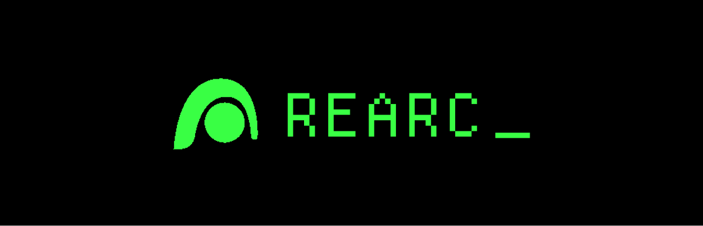

# REARC.XYZ

**AI-Powered Automated Market Maker (AMM) on Arc Network**

REARC.XYZ is a Uniswap V2-style Constant Product AMM integrated with an AI chat assistant, built on the Arc Network. The platform features a retro AS400 terminal aesthetic interface and enables seamless token swaps between USDC, EURC, and REARC tokens.

**[Live Demo](https://rearc.xyz)** (Coming Soon)

## Features

- 🔄 **Uniswap V2-style AMM** - Constant product formula (xy = k) with 0.3% trading fee
- 🤖 **AI Chat Assistant** - Powered by Cloudflare Workers AI using Llama 3.1 8B
- 💰 **Multi-Token Trading** - Swap USDC, EURC, and REARC tokens across 3 liquidity pools
- 🎨 **AS400 Terminal UI** - Retro terminal aesthetic inspired by SRCL design system
- 🔗 **MetaMask Integration** - Seamless wallet connectivity and network switching
- 📊 **Pool Management** - View liquidity pools and add/remove liquidity
- ⚡ **Arc Network** - Built on EVM-compatible Layer-1 with USDC as native gas token

## Project Structure

```
rearc/
├── rearc-frontend/     # Next.js 16 frontend application
├── rearc-contracts/    # Solidity smart contracts (Foundry)
└── rearc-worker/       # Cloudflare Workers AI backend
```

## Quick Start

### Prerequisites

- Node.js 18+ and npm
- MetaMask browser extension
- Foundry (for smart contract development)
- Cloudflare account (for worker deployment)

### Frontend

```bash
cd rearc-frontend
npm install
cp .env.example .env.local  # If you have one
# Update .env.local with your configuration (see Environment Variables section)
npm run dev
```

Visit `http://localhost:3000` in your browser.

### Smart Contracts

```bash
cd rearc-contracts

# Install Foundry (if not already installed)
curl -L https://foundry.paradigm.xyz | bash && foundryup

# Install dependencies
forge install

# Run tests
forge test -vv

# Deploy to Arc testnet
forge script script/Deploy.s.sol \
  --rpc-url https://rpc.testnet.arc.network \
  --broadcast \
  --verify
```

### Cloudflare Worker

```bash
cd rearc-worker
npm install

# Configure wrangler.jsonc with your Cloudflare account details
# Set up Workers AI binding in wrangler.jsonc

# Run locally
npm run dev

# Deploy to Cloudflare
npm run deploy
```

## Network Configuration

### Arc Testnet

- **Network**: Arc Testnet
- **Chain ID**: 5042002
- **RPC URL**: `https://rpc.testnet.arc.network`
- **Explorer**: `https://testnet.arcscan.app`
- **Native Token**: USDC
- **Trading Pairs**: USDC/EURC, USDC/REARC, EURC/REARC

### Token Addresses

- **USDC**: `0x3600000000000000000000000000000000000000`
- **EURC**: `0x89B50855Aa3bE2F677cD6303Cec089B5F319D72a`
- **REARC**: `0xCd77F717d92F2F4221ac05b12A5fd61eb723E6dF`

### Deployed Contract Addresses

**Deployment Date**: Block 10009667

- **REARC Token**: `0xCd77F717d92F2F4221ac05b12A5fd61eb723E6dF`
- **Factory**: `0x400E301d11cEEa405A4f9bb9C62CAcFF54a6822d`
- **Router**: `0xFF836D398B32209cE77416A3138780B095b7CF9C`
- **USDC/EURC Pair**: `0xf1075e89Ed4a50cFf98c1A603a134B84160517F1`
- **USDC/REARC Pair**: `0x6bA4968b67Ea8741BFCe0Ac391CA4AdbDf520246`
- **EURC/REARC Pair**: `0xB250E5f6d9ddDeF7822CFE00b9C069b9D86EE2Cb`

View all contracts on [Arcscan](https://testnet.arcscan.app)

## Deployment

### Smart Contracts

1. **Get Arc Testnet USDC** for gas fees from Circle's testnet faucet
2. **Set up environment**:
   ```bash
   cd rearc-contracts
   echo "PRIVATE_KEY=your_private_key_here" > .env
   ```
   ⚠️ **Security Note**: Never commit your `.env` file. It's already in `.gitignore`.
3. **Deploy contracts**:
   ```bash
   forge script script/Deploy.s.sol \
     --rpc-url https://rpc.testnet.arc.network \
     --broadcast \
     --verify \
     --etherscan-api-key YOUR_ETHERSCAN_API_KEY
   ```
   This script will:
   - Deploy the REARC token (1M tokens to deployer)
   - Deploy the Factory contract
   - Deploy the Router contract
   - Create three liquidity pools (USDC/EURC, USDC/REARC, EURC/REARC)
4. **Save deployment addresses** from the output for frontend and worker configuration

### Frontend (Cloudflare Pages)

1. **Push to Git** repository
2. **Connect to Cloudflare Pages**:
   - Go to [Cloudflare Dashboard](https://dash.cloudflare.com/)
   - Navigate to "Workers & Pages"
   - Create new Pages project
   - Connect your Git repository
3. **Configure build settings**:
   - **Project name**: `rearc-frontend` (or your preferred name)
   - **Production branch**: `main`
   - **Framework preset**: `Next.js (Static HTML Export)`
   - **Root directory**: `rearc-frontend` ⚠️ IMPORTANT
   - **Build command**: `next build`
   - **Build output directory**: `out`
4. **Add environment variables** (see Environment Variables section below)
5. **Deploy** - Cloudflare will automatically build and deploy

**Alternative: Manual Deployment via CLI**
```bash
cd rearc-frontend
npm run build
npx wrangler pages deploy out --project-name=rearc-frontend
```

### Cloudflare Worker

1. **Authenticate with Cloudflare** (if not done):
   ```bash
   cd rearc-worker
   npx wrangler login
   ```
2. **Configure** `wrangler.jsonc` with your Cloudflare account details
3. **Update** `FACTORY_ADDRESS` in `src/index.ts` after contract deployment:
   ```typescript
   const FACTORY_ADDRESS = "0x400E301d11cEEa405A4f9bb9C62CAcFF54a6822d";
   ```
4. **Test locally** (recommended):
   ```bash
   npm run dev
   # Test at http://localhost:8787
   ```
5. **Deploy**:
   ```bash
   npm run deploy
   ```
6. **Update** `NEXT_PUBLIC_WORKER_URL` in frontend environment variables with your worker URL

## Environment Variables

### Frontend (`rearc-frontend/.env.local`)

All variables must be prefixed with `NEXT_PUBLIC_` to be accessible in the browser:

```env
# Arc Network Configuration
NEXT_PUBLIC_ARC_RPC_URL=https://rpc.testnet.arc.network

# Token Addresses
NEXT_PUBLIC_USDC_ADDRESS=0x3600000000000000000000000000000000000000
NEXT_PUBLIC_EURC_ADDRESS=0x89B50855Aa3bE2F677cD6303Cec089B5F319D72a
NEXT_PUBLIC_REARC_ADDRESS=0xCd77F717d92F2F4221ac05b12A5fd61eb723E6dF

# Contract Addresses
NEXT_PUBLIC_FACTORY_ADDRESS=0x400E301d11cEEa405A4f9bb9C62CAcFF54a6822d
NEXT_PUBLIC_ROUTER_ADDRESS=0xFF836D398B32209cE77416A3138780B095b7CF9C

# Pair Addresses
NEXT_PUBLIC_PAIR_USDC_EURC=0xf1075e89Ed4a50cFf98c1A603a134B84160517F1
NEXT_PUBLIC_PAIR_USDC_REARC=0x6bA4968b67Ea8741BFCe0Ac391CA4AdbDf520246
NEXT_PUBLIC_PAIR_EURC_REARC=0xB250E5f6d9ddDeF7822CFE00b9C069b9D86EE2Cb

# Worker URL (update after deploying worker)
NEXT_PUBLIC_WORKER_URL=https://rearc-agent.your-subdomain.workers.dev
```

**For Cloudflare Pages**: Add these as environment variables in the Pages project settings (Settings → Environment variables).

### Worker (`rearc-worker/wrangler.jsonc`)

Configure Cloudflare account details and Workers AI binding:

```jsonc
{
  "name": "rearc-agent",
  "main": "src/index.ts",
  "compatibility_date": "2024-01-01",
  "account_id": "your-account-id",
  "ai": {
    "binding": "AI"
  }
}
```

### Contracts (`rearc-contracts/.env`)

```env
PRIVATE_KEY=your_private_key_here
```

## Getting REARC Tokens

The REARC token was deployed with 1,000,000 tokens to the deployer address. To use them:

### Option 1: Transfer via MetaMask (Easiest)

1. **Get your deployer address** from deployment logs
2. **Import the deployer wallet** to MetaMask:
   - Open MetaMask → Account menu (three dots) → Import Account
   - Enter your private key (the one used for deployment)
3. **Transfer REARC tokens**:
   - Switch to deployer account in MetaMask
   - Go to [REARC Token on Arcscan](https://testnet.arcscan.app/address/0xCd77F717d92F2F4221ac05b12A5fd61eb723E6dF)
   - Use MetaMask or Arcscan to transfer tokens to your main wallet

### Option 2: Use Foundry Cast (Command Line)

```bash
cd rearc-contracts

# Transfer 1000 REARC tokens (adjust amount as needed)
cast send 0xCd77F717d92F2F4221ac05b12A5fd61eb723E6dF \
  "transfer(address,uint256)" \
  YOUR_METAMASK_ADDRESS \
  $(cast --to-wei 1000 ether) \
  --rpc-url https://rpc.testnet.arc.network \
  --private-key YOUR_DEPLOYER_PRIVATE_KEY
```

**REARC Token Details**:
- **Address**: `0xCd77F717d92F2F4221ac05b12A5fd61eb723E6dF`
- **Decimals**: 18
- **Total Supply**: 1,000,000 REARC
- **Initial Holder**: Deployer address

## Post-Deployment Steps

After deploying contracts:

1. **Verify contracts on Arcscan** - Visit the contract addresses listed above
2. **Update frontend configuration** - Add all addresses to `.env.local`
3. **Deploy and configure worker** - Update Factory address and deploy
4. **Test the frontend**:
   - Connect MetaMask wallet
   - Switch to Arc Testnet (Chain ID: 5042002)
   - Test viewing balances, swaps, and AI chat
5. **Add initial liquidity** (optional) - Use the liquidity page or Router contract directly
6. **Test swaps** - Once liquidity is added, test swaps on all 3 pools

## Setting Up Arc Network in MetaMask

1. Open MetaMask
2. Go to Settings → Networks → Add Network
3. Enter:
   - **Network Name**: Arc Testnet
   - **RPC URL**: `https://rpc.testnet.arc.network`
   - **Chain ID**: `5042002`
   - **Currency Symbol**: USDC
   - **Block Explorer**: `https://testnet.arcscan.app`

## Tech Stack

### Frontend
- **Framework**: Next.js 16 with App Router
- **Language**: TypeScript
- **Styling**: Tailwind CSS, SCSS modules
- **Wallet**: MetaMask SDK, ethers.js v6
- **Design**: SRCL-inspired AS400 terminal aesthetic

### Smart Contracts
- **Language**: Solidity
- **Framework**: Foundry
- **Pattern**: Uniswap V2-style AMM
- **Contracts**: Factory, Pair, Router, REARC Token

### Backend
- **Platform**: Cloudflare Workers
- **AI**: Cloudflare Workers AI (Llama 3.1 8B)
- **Language**: TypeScript

### Blockchain
- **Network**: Arc Network (Chain ID: 5042002)
- **Compatibility**: EVM-compatible
- **Gas Token**: USDC

## Development

### Running Tests

**Smart Contracts**:
```bash
cd rearc-contracts
forge test -vv
```

**Worker**:
```bash
cd rearc-worker
npm test
```

### Local Development

**Frontend**:
```bash
cd rearc-frontend
npm run dev
# Visit http://localhost:3000
```

**Worker**:
```bash
cd rearc-worker
npm run dev
# Available at http://localhost:8787
# Update NEXT_PUBLIC_WORKER_URL=http://localhost:8787 in frontend .env.local
```

## Project Status

### ✅ Completed
- Frontend UI with AS400 terminal aesthetic
- Smart contracts (Factory, Pair, Router, REARC Token)
- Cloudflare Worker with AI integration
- Wallet integration and network switching
- Swap interface for all 3 pools
- Liquidity management (add/remove)
- Balance display for all tokens
- AI chat assistant with on-chain data queries
- All contracts deployed to Arc Testnet

### 🚧 In Progress
- Multi-pool support enhancements
- Additional AI capabilities

### 📋 Planned
- Price charts
- Transaction history
- Pool analytics
- Enhanced AI features

## Troubleshooting

### Contracts Not Deploying
- Ensure you have USDC for gas fees
- Check RPC URL is correct: `https://rpc.testnet.arc.network`
- Verify private key is correct in `.env`
- Check network is accessible

### Frontend Not Connecting
- Check MetaMask is on Arc Testnet (Chain ID: 5042002)
- Verify contract addresses are correct in `.env.local`
- Check browser console for errors
- Ensure all environment variables are set

### Worker Not Responding
- Verify worker is deployed: `npx wrangler deployments list`
- Check worker logs: `npx wrangler tail`
- Verify CORS headers are set correctly
- Check that AI binding is configured in `wrangler.jsonc`
- Ensure Workers AI is enabled in Cloudflare dashboard

### AI Chat Not Working
- Verify `NEXT_PUBLIC_WORKER_URL` is set correctly
- Check that the worker is deployed and accessible
- Verify CORS is configured on the worker
- Check browser console for network errors
- Test worker directly with curl:
  ```bash
  curl -X POST https://your-worker.workers.dev \
    -H "Content-Type: application/json" \
    -d '{"message":"test","address":"0x..."}'
  ```

### Swaps Not Working
- Verify you have sufficient token balances
- Check that pools have liquidity
- Verify contract addresses are correct
- Check browser console for transaction errors

## Sub-Projects

- **[rearc-contracts](./rearc-contracts/README.md)** - Smart contracts documentation
- **[rearc-frontend](./rearc-frontend/README.md)** - Frontend documentation
- **[rearc-worker](./rearc-worker/README.md)** - Worker documentation

## License

See [LICENSE](LICENSE) file for details.

## Contact

For questions or support, please open an issue on GitHub.

---

**Built with ❤️ by Bastian Koh on Arc Network**
